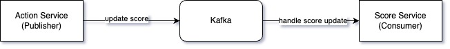

# Functional Requirement
- Display top 10 players on the leaderboard
- Real-time update on scorers
- Score updates are updated on the leaderboard in real-time
- Authorization with score update action

# API Design
## POST /v1/login
User logins with username or password. Then the system will return the access token and refresh token so that user can use that information to do action in the system
### Field
- username
- password

## POST /v1/actions
User takes action. At the end of the action, scores will be added
### Field
- Authorization: access token

## POST /v1/scores
When the action finishes, make a call to this API to update the user's score
### Field
- Authorization: access token
- user_id: ID of user
- score: Scores are added by the user

## GET /v1/scores
Make a list of the top 10 people with the highest scores. 
The returned result can be a object list with each element having the following format
### Result field
- user_id: 1
- user_name: Alice
- rank: 1
- score: 100

# High level design
1. The user logs in to authenticate information
2. The user sends a command to perform an action to the action service
3. The user sends a score update command to the score service
4. Score service saves scores into the DB
5. The user can then call the API to get the top 10 people with the highest scores from the score service

  

## Database Selection
If a relational database is used (like MySQL), the command when selecting top 10 score will be looked like this
- select user_id, score, rank() over (partition by score) as ranking from score_table where ranking <= 10

This command works if the data is small, however if we have millions of users the latency will be very high because when running this command, MySQL will have to sort all the scores in the table to get the last 10 people.
So I suggest using Redis in this case. Redis has a data structure called sorted set and related API: 
- ZINCRBY: insert user score into the data structure if it doesn't exist. Otherwise, update the score for the user. It takes O(log(n)) to execute
- ZREVRANGE: fetch a range of users sorted by the score. This take O(log(n) + m) where m is the number of entries to fetch and n is the number of entries in the sorted set.

## Too much POST /v1/scores commands
- If the user sends too many POST /v1/scores commands from the action service to the score service, it may be necessary to build a message queue to easily expand the score service, avoiding overload.

  

